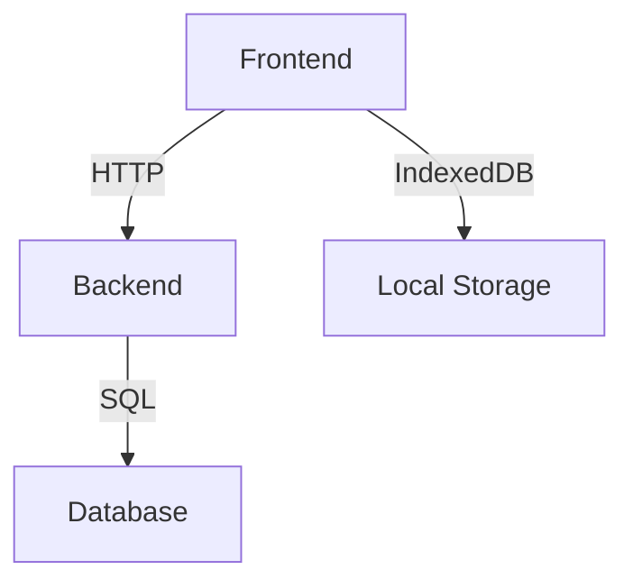
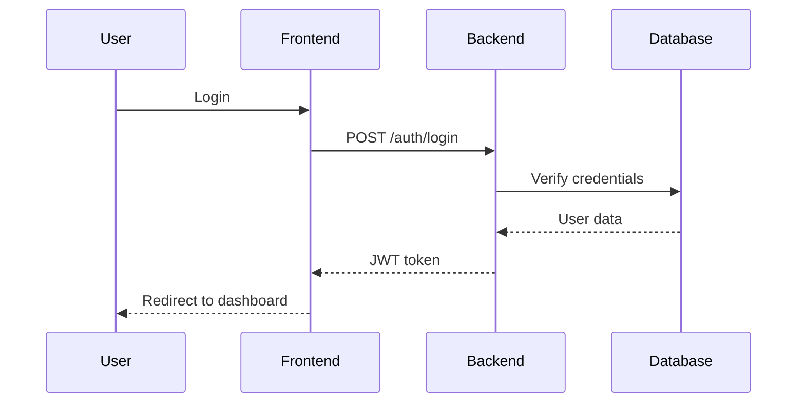
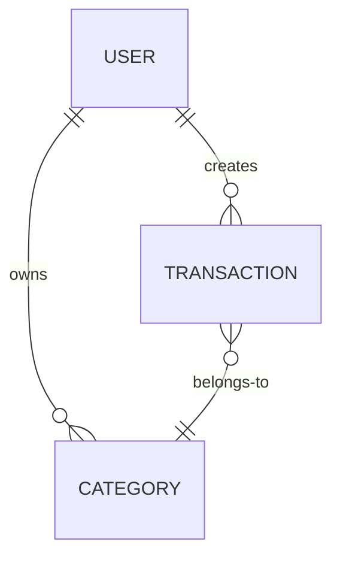

# Documentation Instructions

## Documentation Structure

All documentation lives in the `docs/` folder:

```
docs/
├── README.md               # Documentation index
├── project/                # Project documentation
│   ├── ACTION_PLAN.md      # Implementation roadmap
│   ├── API_DESIGN.md       # API specification
│   ├── STATUS.md           # Current project status
│   └── QUICK_REFERENCE.md  # Quick reference guide
└── compliance/             # GDPR and legal docs
    ├── GDPR_COMPLIANCE.md
    └── PRIVACY_POLICY_TEMPLATE.md
```

## Writing Guidelines

### General Principles

1. **Write in English** - All code and documentation must be in English
2. **Be clear and concise** - Avoid jargon, explain acronyms
3. **Use examples** - Show, don't just tell
4. **Keep it updated** - Documentation should reflect current state
5. **Use proper formatting** - Follow Markdown best practices

### Markdown Formatting

#### Headings

```markdown
# H1 - Document Title (only one per file)
## H2 - Main Sections
### H3 - Subsections
#### H4 - Sub-subsections
```

#### Code Blocks

Always specify the language:

```markdown
```typescript
const example = "code";
```
```

#### Lists

```markdown
- Unordered list item
- Another item
  - Nested item

1. Ordered list item
2. Another item
```

#### Links

```markdown
[Link text](https://example.com)
[Relative link](../other-doc.md)
```

#### Tables

```markdown
| Column 1 | Column 2 | Column 3 |
|----------|----------|----------|
| Value 1  | Value 2  | Value 3  |
```

#### Emphasis

```markdown
**bold text**
*italic text*
`inline code`
```

## Types of Documentation

### API Documentation

- Use Swagger/OpenAPI for backend API
- Document all endpoints, parameters, responses
- Include examples and error cases

**Location:** Auto-generated at `/api/docs` + in `docs/project/API_DESIGN.md`

### Architecture Documentation

- Explain system design decisions
- Include diagrams when helpful
- Document data flow and relationships

**Location:** `docs/project/`

### User Documentation (Future)

- Step-by-step guides
- Screenshots/videos when helpful
- FAQs and troubleshooting

**Location:** `docs/user/` (to be created)

### Development Documentation

- Setup instructions
- Contribution guidelines
- Coding standards

**Location:** `README.md`, `.github/instructions/`

## Documentation Templates

### Feature Documentation Template

```markdown
# Feature Name

## Overview
Brief description of what the feature does and why it exists.

## Use Cases
- Primary use case
- Secondary use case
- Edge cases

## Implementation
Technical details about how it's implemented.

### Backend
- Endpoints
- Database changes
- Business logic

### Frontend
- UI components
- User flow
- State management

## Testing
How to test this feature (manual and automated).

## Future Improvements
Ideas for enhancements.
```

### API Endpoint Documentation Template

```markdown
### Endpoint Name

**URL:** `POST /api/resource`

**Authentication:** Required (JWT)

**Request Body:**
```json
{
  "field1": "string",
  "field2": "number"
}
```

**Success Response (201):**
```json
{
  "success": true,
  "message": "Resource created",
  "data": {
    "id": "uuid",
    "field1": "string",
    "field2": 123
  }
}
```

**Error Responses:**
- `400 Bad Request` - Invalid input
- `401 Unauthorized` - Not authenticated
- `409 Conflict` - Resource already exists

**Example:**
```bash
curl -X POST http://localhost:3000/api/resource \
  -H "Authorization: Bearer <token>" \
  -H "Content-Type: application/json" \
  -d '{"field1":"value","field2":123}'
```
```

### Change Log Template

```markdown
## [Version] - YYYY-MM-DD

### Added
- New feature 1
- New feature 2

### Changed
- Modified behavior 1
- Updated dependency 2

### Fixed
- Bug fix 1
- Bug fix 2

### Removed
- Deprecated feature 1
```

## Status Documentation

### ACTION_PLAN.md

- Track implementation progress
- Update weekly with status
- Mark completed tasks with ✅
- Note blockers and decisions

**Format:**
```markdown
### Week X: [Title]
**Dates:** DD/MM - DD/MM
**Status:** 🔵 Not Started | 🟡 In Progress | 🟢 Complete | 🔴 Blocked

#### Tasks
- [x] Completed task
- [ ] Pending task

#### Notes
- Important note
- Decision made
```

### STATUS.md

- Current state of the project
- What's working, what's not
- Known issues
- Next priorities

**Update:** After major changes or weekly

## README Files

Each package should have its own README:

### Package README Template

```markdown
# Package Name

Brief description of the package.

## Installation

```bash
npm install
```

## Development

```bash
npm run dev
```

## Testing

```bash
npm run test
npm run test:cov
```

## Build

```bash
npm run build
```

## Structure

Brief overview of folder structure.

## Key Features

- Feature 1
- Feature 2

## Dependencies

Notable dependencies and why they're used.
```

## Code Comments

### When to Comment

✅ **DO Comment:**
- Complex business logic
- Non-obvious solutions
- Temporary workarounds (with TODO)
- Public API methods (JSDoc)
- Configuration files

❌ **DON'T Comment:**
- Obvious code
- Code that explains itself
- Out-of-date comments
- Commented-out code (delete it)

### JSDoc for Public APIs

```typescript
/**
 * Creates a new transaction.
 * 
 * @param userId - The ID of the user creating the transaction
 * @param dto - The transaction data
 * @returns The created transaction
 * @throws {NotFoundException} If category or payment method not found
 * @throws {ConflictException} If transaction already exists
 * 
 * @example
 * const transaction = await service.create('user-123', {
 *   amount: -50.00,
 *   description: 'Groceries',
 *   categoryId: 'cat-123',
 *   paymentMethodId: 'pm-123'
 * });
 */
async create(userId: string, dto: CreateTransactionDto): Promise<Transaction> {
  // Implementation
}
```

### Inline Comments

```typescript
// ✅ Good: Explains WHY
// Using setTimeout to avoid race condition with React's state batching
setTimeout(() => setData(newData), 0);

// ❌ Bad: Explains WHAT (obvious from code)
// Set the name to John
const name = 'John';
```

### TODO Comments

```typescript
// TODO: Implement pagination (Issue #123)
// FIXME: This causes memory leak on large datasets
// HACK: Temporary fix until API is updated
// NOTE: This must be called before initialization
```

## Diagrams

Use Mermaid for diagrams (rendered by GitHub):

### Architecture Diagram

```markdown

```

### Sequence Diagram

```markdown

```

### Entity Relationship

```markdown

```

## Documentation Checklist

When adding/updating documentation:

- [ ] Written in English
- [ ] Clear and concise
- [ ] Includes examples
- [ ] Markdown properly formatted
- [ ] Links are valid
- [ ] Code blocks have language specified
- [ ] No typos or grammar errors
- [ ] Updated table of contents (if applicable)
- [ ] Related documentation updated
- [ ] Committed with descriptive message

## Common Documentation Tasks

### Adding a New Feature

1. Update `ACTION_PLAN.md` with status
2. Update `API_DESIGN.md` if API changes
3. Update relevant README files
4. Add JSDoc comments to public APIs
5. Update `STATUS.md` with current state

### Updating Existing Feature

1. Update code comments
2. Update API documentation
3. Update examples
4. Note changes in commit message

### Reporting a Bug

1. Create issue with:
   - Clear description
   - Steps to reproduce
   - Expected vs actual behavior
   - Environment details
   - Screenshots/logs if applicable

### Documenting a Decision

1. Add to `ACTION_PLAN.md` under "Decision Points"
2. Explain options, pros/cons
3. Document final decision and rationale
4. Reference in relevant code comments

## Review Checklist

Before merging documentation changes:

- [ ] All links work
- [ ] Code examples are valid
- [ ] Formatting is consistent
- [ ] No sensitive information included
- [ ] Reflects current implementation
- [ ] Related docs are updated

